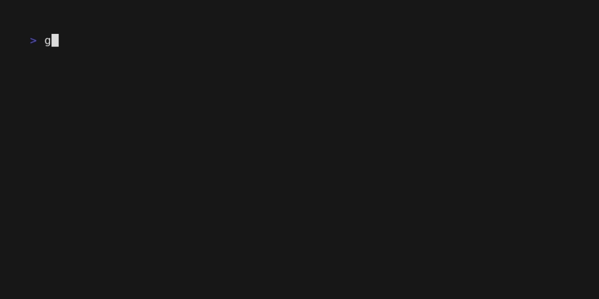

# Generate DDG
[](https://github.com/slashtechno/generate-ddg/actions/workflows/go-build.yml) 

Go program that allows you to generate DuckDuckGo email aliases from the command line.


### Setup and Usage
1. Create a [Duck Address](https://duckduckgo.com/email/) if you don't already have one  
2. Run `generate-ddg config` to complete the initial setup.
    - Config key names can also be set as environment variables (capitalized and `-` replaced with `_`)
    - `.env` is loaded
3. Run `generate-ddg`  
    - In some cases, this may error if DuckDuckGo suspects you are a bot. If this happens, try to login normally (through DuckDuckGo) and when the magic link/phrase is sent to your email, run the program again with `--otp "<phrase>"`.  
    - The refresh token will be stored in `<XDG_CONFIG_HOME>/generate-ddg/secrets.yaml`. The directory is dependent on your OS:
        - Linux: `~/.config/generate-ddg.
        - Windows: `%APPDATA%\generate-ddg`
        - MacOS: `~/Library/Application Support/generate-ddg`
        - For more information, see [adrg/xdg](https://github.com/adrg/xdg?tab=readme-ov-file#xdg-base-directory)
4. The program will generate a new email alias and print it to the console.  

### Installation  

#### Binary  
Download the latest release from the [releases page](https://github.com/slashtechno/generate-ddg/releases), ensuring you download the correct binary for your system.  
Execute the binary from the command line! Optionally, you can move it to a directory in your PATH.  
For example, on Linux, if you've downloaded `generate-ddg_linux_amd64` to your Downloads directory:  
```sh
mv ~/Downloads/generate-ddg_linux_amd64 /usr/local/bin/generate-ddg
chmod +x /usr/local/bin/generate-ddg
generate-ddg # Run it!
```

#### Building from source  
Ensure you have Go installed on your system.  
```sh
git clone https://github.com/slashtechno/generate-ddg.git
cd generate-ddg
go install
```


### Contributing  
Pull Requests are welcome!  

### Acknowledgements  
* [whatk233/ddg-email-panel](https://github.com/whatk233/ddg-email-panel)  
    * Ended up looking through the source code to get a better understanding of how DuckDuckGo's authentication works.
* [DuckDuckGo](https://duckduckgo.com/email/)
    * I've not run into any issues (at the time of writing) with their service and it's worked quite well for me.
* [Bitwarden](https://bitwarden.com/)
    * They have a [feature](https://bitwarden.com/help/generator/#tab-duckduckgo-3Uj911RtQsJD9OAhUuoKrz) wherein you can input the API token for DuckDuckGo (retrieved from DevTools' Network tab) allowing you to generate aliases from within the Bitwarden.